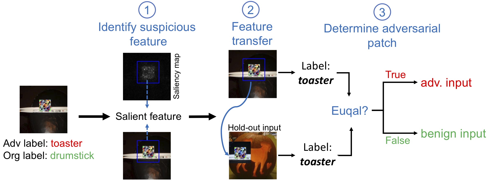
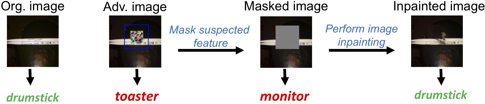

# Code for paper "Turning Your Strength against You: Detecting and Mitigating Robust and Universal Adversarial Patch Attack" link to paper

This paper introduces a technique to *detect and mitigation* robust and universal adversarial patch attack. Below demonstrates the main ideas behind our technique:

## Attack Detection


<br/>

## Attack Mitigation



## Requirements
- PyTorch (1.2.0 or higher)
- Torch-vision (0.2.1 or higher)
- numpy
- scipy
- tpdm
- OpenCV 
- visdom 
- dominate
- tested on Python 3.7.3


## How to run

Download the data for ImageNette dataset at https://drive.google.com/file/d/16d8DsecjnWBKoupQQR0ZkWL9yHGSqSje/view?usp=sharing, unzip it and put it under the main directory. This folder contains the entire ImageNette dataset, a set of hold-out images and their saliency maps, and the weights of a ResNet-18 model.


### Detection
```
./detection.sh
```

This will: 1) generate a set of adversarial and benign samples (target label for adv sample is class 5); and 2) perform attack detection on these samples. The output contains the following 2 metrics:
 
- ```Detection success recall```: Amount of adversarial samples detected.
- ```False positive (FP)```: Amount of benign samples mis-detected as adversarial ones.


### Mitigation
```
./mitigation.sh
```

This will perform attack mitigation, the output contains the following 3 metrics:

- ```Robust accuracy```: Accuracy on adversarial samples (for mitigation)
- ```(Reduced) detection success recall```: This shows out of all the detected adversarial samples, how many of them will be **mis-identified** as benign samples (*the lower the better*). This gives the final amount of detected adversarial samples.
- ```Reduced (FP)```: This shows out of all the FPs on benign samples, how many of them will be **correctly identified** as benign (*the higher the better*). This gives the final FP of our technique.


*```detailed-usage.md``` explains the usage of each Python file in this repo.*


# Citation
If you find this code useful, please consider citing our paper

```
@article{chen2021turning,
  title={Turning Your Strength against You: Detecting and Mitigating Robust and Universal Adversarial Patch Attacks},
  author={Chen, Zitao and Dash, Pritam and Pattabiraman, Karthik},
  journal={arXiv preprint arXiv:2108.05075},
  year={2021}
}
```


